# General Assembly Capstone Project

## Horses or Humans: Support Vector Machines

Research and innovation within computer vision have increased dramatically over the past 5 years, with Convolutional Neural Networks and Deep Learning at the fore front in this area of Data Science and Machine Learning.  

Nonetheless, the Support Vector Machine is still a very robust supervised classification technique that yields impressive results.  For this project, I chose to use build a Support Vector Machine to classify whether an image is of a horse or a human.  Using Laurence Moroney’s dataset Horses or Humans, I trained a model that classified these images: 1 as ‘human’, 0 as ‘horse’.

## Horses or Humans Dataset

The Horses or Humans dataset consists of 300x300 images, created by Laurence Moroney.  Moroney ‘wanted a dataset that could be used for teaching binary classifiers that was unique and distinct from existing datasets.’ 

The set is made up of Photoreal CGI, with 500 images of humans and 527 images of horses in the train set.  For the test set, there are 128 images of humans and 128 images of horses.

The images were designed in such a way to try avoiding bias; therefore, the images of humans include figures of different ethnicities as well as against different backgrounds (eg. at the beach or in a forest).  The horse images also feature subject matter with various coat colours, creating more diversity to reflect reality. 

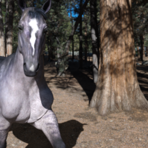

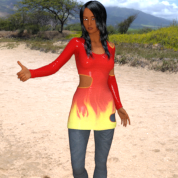 

## Support Vector Machine

The objective of the support vector machine algorithm is to find a hyperplane in an N-dimensional space that distinctly classifies the data points.  Hyperplanes are decision boundaries that aid in classifying data points; and any data points that fall on either side of the hyperplane can be attributed to different classes.  

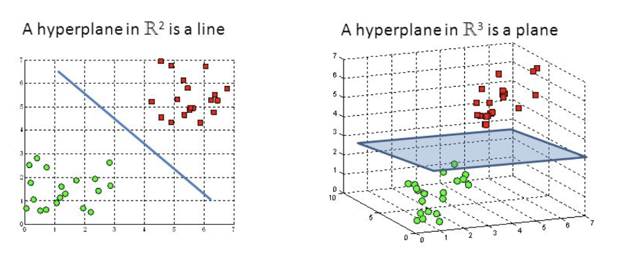  

Support vectors are data points that are closer to the hyperplane and influence the position and orientation of the hyperplane.  Using these support vectors, we maximise the margin of the classifier.  The goal is to maximise the margin between the data points and the hyperplane.

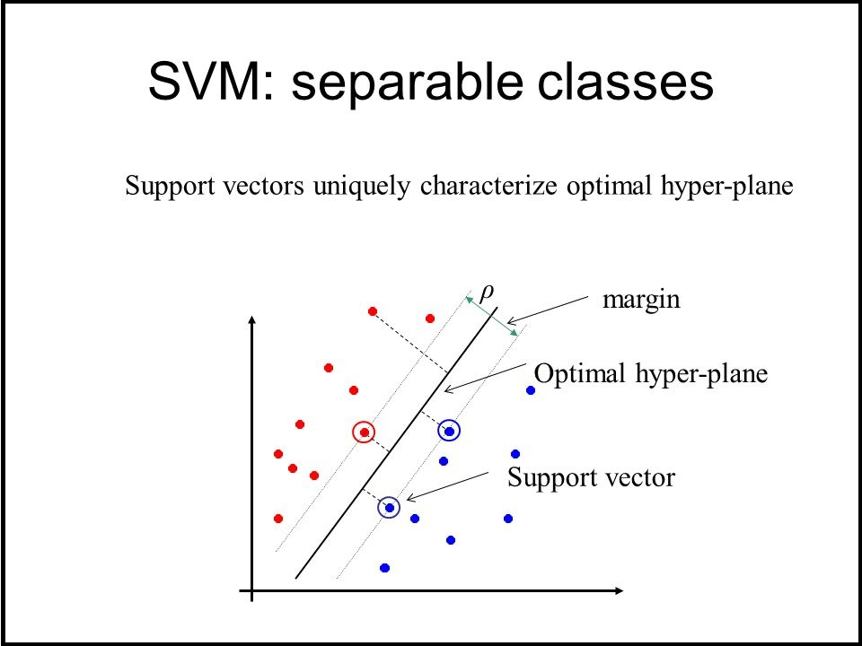

Fortunately, Scikit-learn provides useful tools to build a classifier as well as summarise the performance accuracy of the model in predicting the class of a data point.  

## EDA & Feature Extraction

Each image is a tensor of 300x300x4, therefore consisting of 4 channels with height 300 and width 300 per channel.  

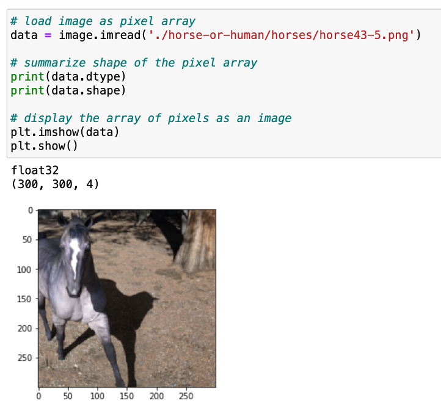
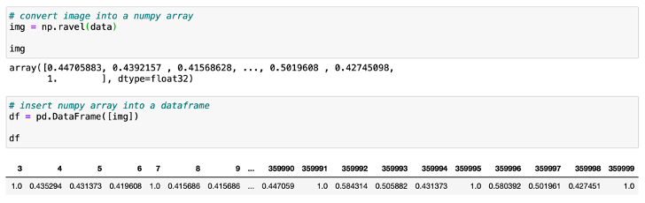

So as to identify the most prominent features, I resized the images to 40x40, converted to grayscale and flattened the tensor into a 1-D pixel array.  Therefore, each image in the train and test sets would be of size 1 x 1,600.  

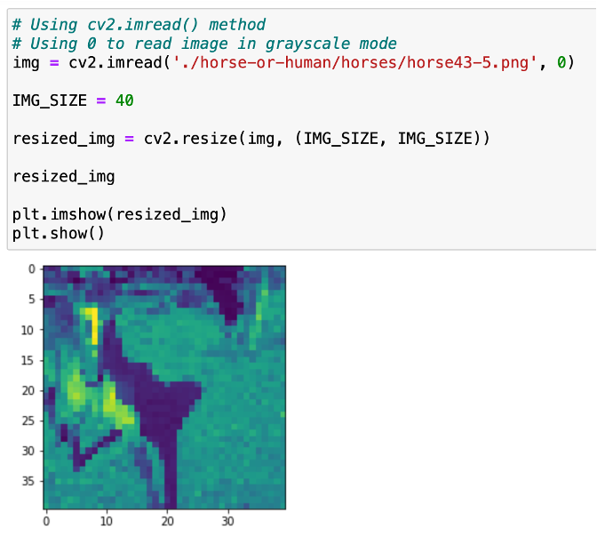

## Training & Testing

As the horse-v-human dataset specifies a train set (1027 images) and a test set (256 images), I did not perform a Scikit-learn ‘train-test split’ on the data.  In order to the train my model, I used all 1027 images in the train set and made the classification column “category” the target: (1 or 0) for human or horse.  For the features, I selected all of the pixel columns (columns 0-1599). 

With regards to parameters, I chose to keep everything to ‘default’ as recommended by Scikit-learn.  Given the size of N-features, the most appropriate kernel to use was the Gaussian radial basis function (kernel = ‘rbf’).  

With SVMs, the regularization parameter, ‘C’, is used to control error (default being 1.0).  By keeping ‘C’ low, the idea is that the error would also be low, allowing for some degree of freedom so as to achieve the best hyperplane.  A larger value of ‘C ‘would very likely lead to overfitting. 

## Evaluation

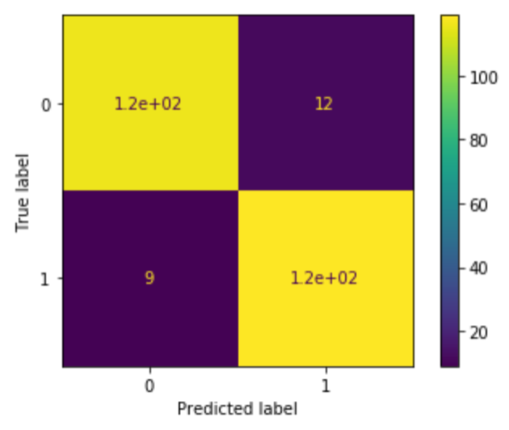
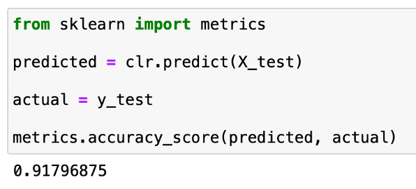

Of the 256 images, the classifier predicted 21 images incorrectly.  12 of the test set images featuring horses were predicted as ‘human’, and 9 of the test set images featuring humans were predicted as ‘horse’.

The SVM classifies images based on the pixel structures – and with the images reduced in resolution – the data outlines the shape of the subject matter.  Therefore, one can form conclusions for why the images of horses were predicted as ‘human’, namely the pose of the horse images are ‘forward-facing’, ‘narrow-bodied’ and rather ‘tall/ vertically inclined’.  In other words, the silhouette is more ‘human-like’. 

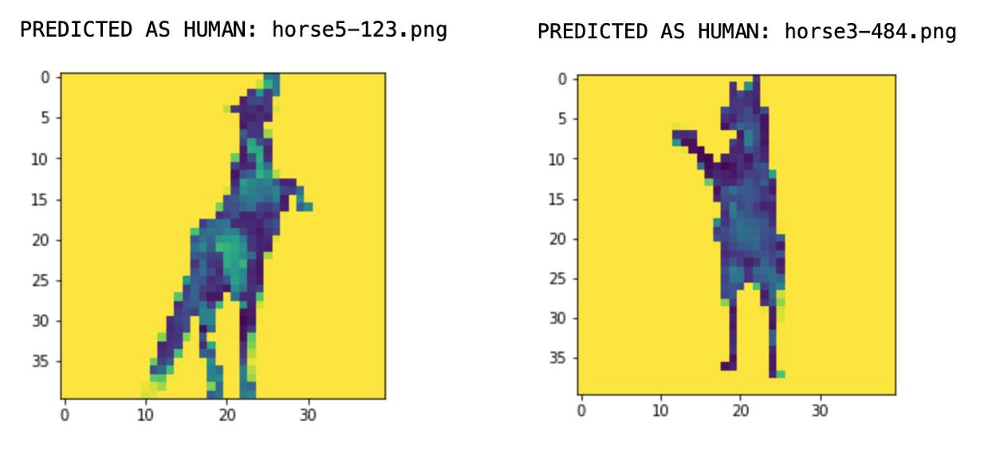

The images of humans incorrectly predicted as ‘horse’ are quite difficult to evaluate; though, one could comment that the stance of the subject matters are quite ‘performative’, limbs are more ‘wide’ in stature.

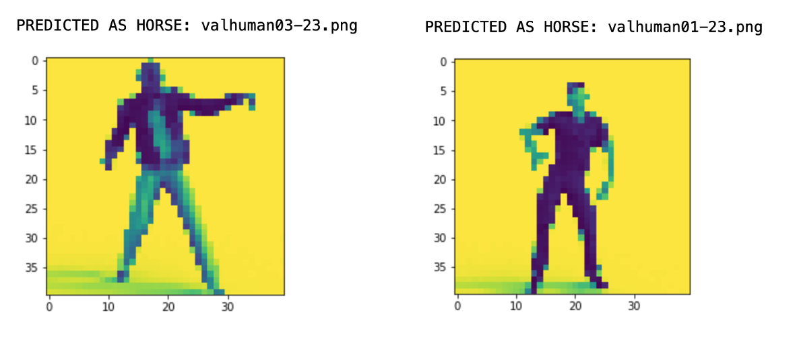
